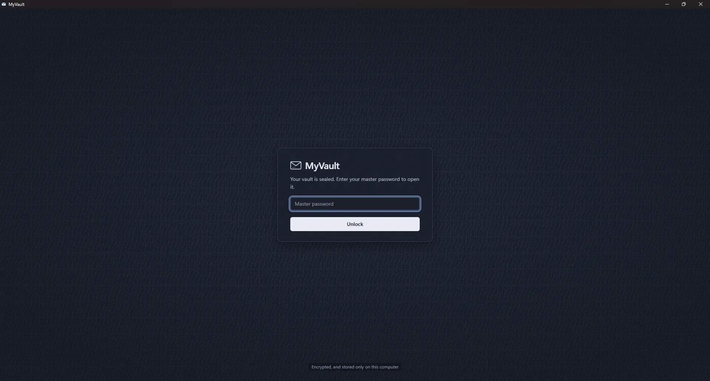
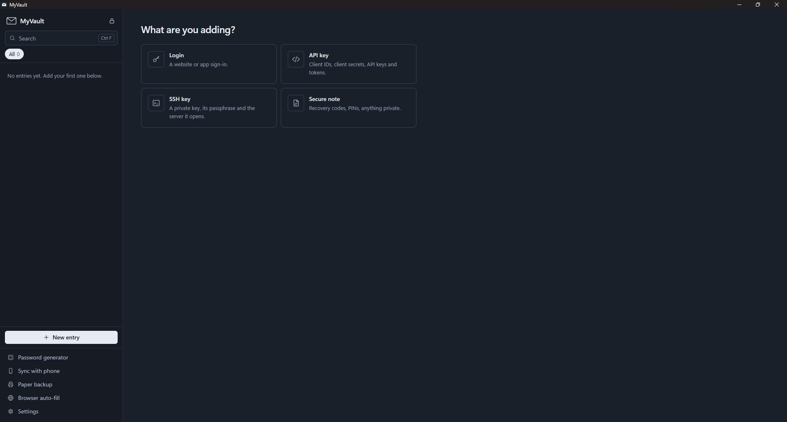
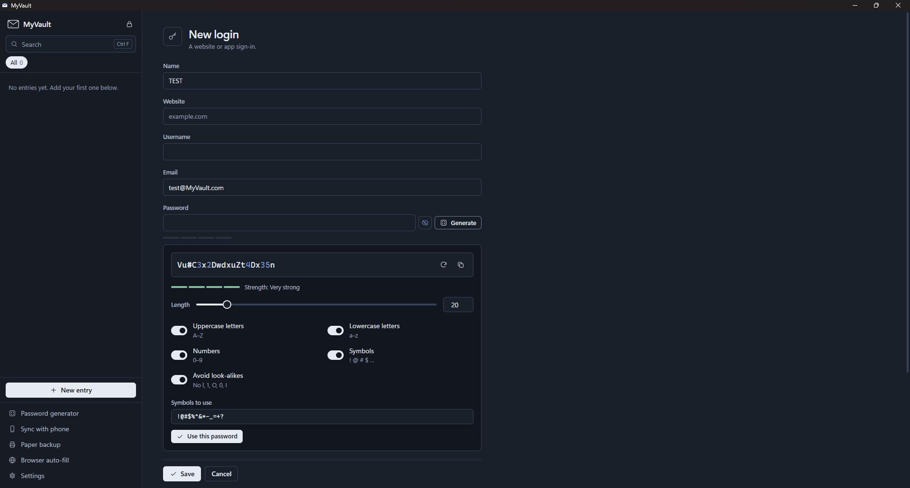
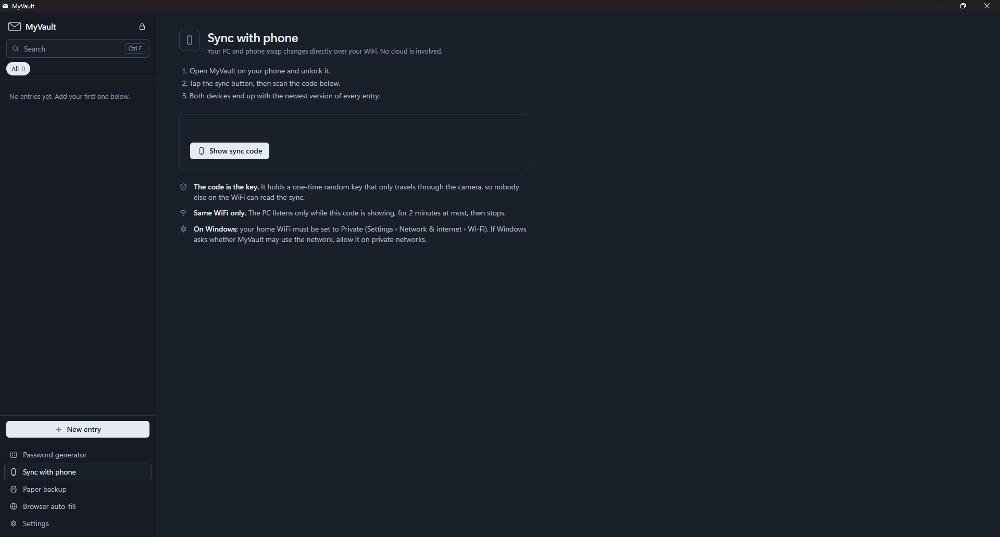
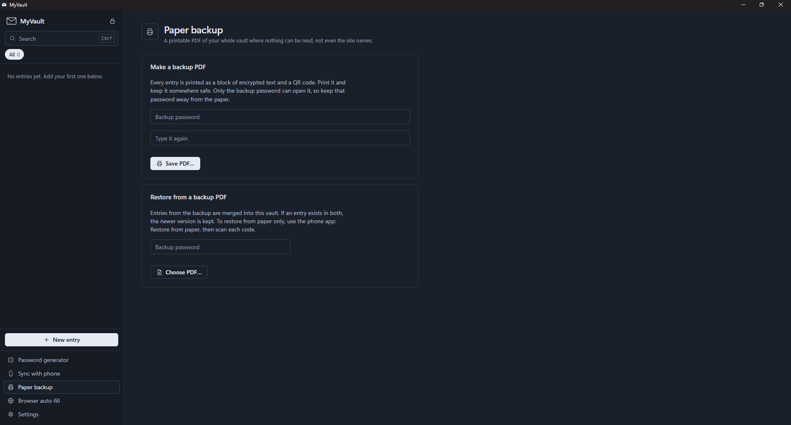

# MyVault

An offline password manager for Windows and Android. One master password opens
an encrypted vault holding your logins, API keys, client IDs and secrets, SSH
keys, and private notes. Nothing goes to a cloud or a company.

- **Encrypted on disk.** scrypt turns your master password into a key, and
  AES-256-GCM seals the vault with it. The password itself is never stored.
- **Sync by QR code.** Your PC shows a one-time code, your phone scans it, and the
  two swap changes over your own WiFi. No account and no server.
- **Paper backup.** Print the whole vault as a PDF where nothing is readable,
  not even the site names. The app reads the PDF back, and the phone can restore
  from the printed QR codes.
- **Browser fill.** A small extension for Chrome, Edge, Brave and Comet fills
  logins when you click a login box. On sign-up forms it suggests a strong
  password, and saves the new account once you use it.
- **Fill other apps.** On Android, MyVault can be the phone's autofill service, so
  it fills and saves logins in any app or in Chrome. On Windows, **Type into app**
  types a login into the program behind MyVault.

> **There is no password reset.** If you forget the master password, nobody can
> open the vault, not even you. That's what keeps it safe. Write the master
> password down and keep it somewhere physical.

## Screenshots



| | |
|---|---|
|  |  |
| **New entry:** logins, API keys, SSH keys and secure notes | **Password generator:** length slider and character toggles |
|  |  |
| **Sync with phone** over your own WiFi, by QR code | **Paper backup:** a PDF where nothing is readable |

---

## Windows app

**Install it:** run `MyVault-Setup-<version>.exe` from the **Releases** page. It
installs like any other app, with a desktop shortcut, a Start menu entry and an
uninstaller under *Settings → Apps*. No admin rights needed: it goes into
`%LOCALAPPDATA%\Programs\MyVault`, or Program Files if you choose "install for
all users". Because the installer isn't code-signed yet, Windows SmartScreen may
say it "protected your PC": choose **More info → Run anyway**.

Your vault is stored separately in `%LOCALAPPDATA%\MyVault\vault.dat`, so
updating or uninstalling the app never touches it. **Settings → Folders** opens
the vault folder, the program folder and the browser-extension folder in
Explorer.

**Run from source** (for development): double-click `run_myvault.bat`. Set it up
once on a new machine:

```bash
python -m venv .venv
```

```bash
.venv\Scripts\pip install -r requirements.txt
```

**Build the installer yourself:**

```bash
.venv\Scripts\pip install -r requirements-dev.txt
```

```bash
.venv\Scripts\python packaging\build_windows.py
```

That writes `dist\MyVault\MyVault.exe` and `dist\MyVault-Setup-<version>.exe`. It
needs [Inno Setup 6](https://jrsoftware.org/isinfo.php)
(`winget install JRSoftware.InnoSetup`). The icons come from
`tools\make_icons.py`.

What's in it:

| | |
|---|---|
| Entry types | Login, API key (service, endpoint, client ID, client secret, API key, token), SSH key (host, port, user, private key, passphrase, public key, fingerprint), secure note. Plus extra fields of your own on any entry. |
| Reveal | Secret values stay under a printed "security tint" until you choose to show them, and cover themselves again after 20 seconds. |
| Copy | Copied secrets skip Windows clipboard history (Win+V) and cloud clipboard, and clear after 30 seconds. |
| Generator | Uppercase, lowercase, numbers and symbols toggles, avoid look-alike characters, length slider from 6 to 128, strength meter. |
| 2FA codes | Paste a site's two-factor setup key or `otpauth://` link into a login's **2FA secret**, and the login shows the current 6-digit code, counting down, ready to copy. No separate authenticator app needed. |
| Password history | When you change a login's password, the old one is kept under **Previous passwords** (the last 10), in case the change didn't go through on the site. |
| Password health | Lists weak and reused passwords. **Check for leaked passwords** (only when you press it) asks Have I Been Pwned using just the first 5 characters of each password's SHA-1 hash; see [PRIVACY.md](PRIVACY.md). |
| Files on any entry | Attach photos or PDFs to any entry (a login's recovery codes, say), encrypted like document files. |
| Import | **Settings → Import passwords** takes a CSV export from Chrome, Edge, Firefox, Bitwarden, LastPass, 1Password, KeePass and most others, and skips logins you already have. |
| Daily backups | Once a day MyVault copies the encrypted vault file to `%LOCALAPPDATA%\MyVault\backups`, keeping 14 days. **Settings → Automatic backups → Restore** brings back entries deleted since then. |
| Auto-lock | After 5 minutes without use (change it in Settings), or at once with `Ctrl L` or the tray icon. |
| Runs in the background | The X button hides MyVault to the notification area by the clock, so browser fill keeps working with no taskbar button. Click the icon to open it; right-click it to lock or quit. With **Start with Windows** on, it starts there, locked. |
| Keyboard | `Ctrl F` search, `Ctrl N` new login, `Ctrl S` save, `Ctrl L` lock, arrow keys in the list. |

The vault file is useless without your master password, so you can copy it to a
USB stick as a backup.

## Android app

A Flutter app in [`android_app/`](android_app/) that opens the same vault format.
Download the APK from the **Releases** page, or build it yourself (see
[`android_app/README.md`](android_app/README.md)).

The phone app has the same entry types, reveal and generator. It locks after 30
seconds in the background or 5 minutes idle (change both under **menu › Auto-lock**),
blocks screenshots and the recent-apps preview, marks copied secrets as sensitive,
and is excluded from Google cloud backup.

It also has **2FA codes** (scan the site's setup QR code into a login's 2FA
secret), **Previous passwords**, **files on any entry** and **menu › Password
health**, like the Windows app. **Fingerprint unlock:** after you unlock with
the password, MyVault offers to open with your fingerprint or face next time
(Android 10 and later; switch it under **menu › Auto-lock**). The master password
is kept encrypted by an Android Keystore key that only a strong biometric opens,
and it stops working if fingerprints are added or removed.

**Autofill in other apps:** open **menu › Autofill in other apps › Turn on** and
pick MyVault. Then:

- Tap a login box in any app and choose **Fill with MyVault**. MyVault asks for
  your master password, then you pick the account.
- When you sign in or sign up somewhere new, Android asks **Save to MyVault?**.
  The login is sealed with a key held by the Android Keystore until your next
  unlock, then added to the vault.
- Website addresses are trusted only when a real browser reports them. Any other
  app is matched by its app id, so an app can't pretend to be your bank's
  website.

## Sync PC ↔ phone

1. PC: **Sync with phone → Show sync code.**
2. Phone: tap the **scan** button and point the camera at the code.
3. Both end up with the newest version of every entry. Deletions carry across.

The code holds a one-time random 256-bit key and the PC's address. The key only
travels through the camera, so nobody else on the WiFi can read or tamper with
the exchange. The PC listens only while the code is on screen, for at most two
minutes, and stops after one sync. The first time, Windows may ask whether
MyVault may use the network: allow it on **private** networks.

## Updates

- **When you sync,** each device tells the other its version. If the PC is newer
  it hands the phone its update over the encrypted channel, and the phone asks
  "Install now?". It works the other way too: a phone that updated online
  passes the PC its installer. No internet is needed.
- **Online (optional, asked once):** new versions come out now and then. To spot
  them, the apps look (at most once a day) at a small,
  signed version file from this repo's Releases page. Nothing from the vault is
  ever sent. Updates are only installed if they carry the maintainer's
  signature, and Android also checks that the APK is signed with MyVault's
  release key.
- **Installing an update replaces the old version.** Only the program is
  replaced; your vault is never touched.
- **Going back (Windows):** Settings › Updates › **Go back to the previous
  version**. MyVault finds the newest stable (not pre-release) release before
  yours, checks its signature, copies your vault to
  `vault-before-rollback-<version>.dat`, then installs it. Do it again to go
  further back, as far as 0.5.0 (older releases aren't signed).
- **Going back (Android):** Android won't install an older version over a newer
  one, and uninstalling removes the phone's copy of the vault. So sync with the
  PC first, uninstall, install the older APK from Releases, then sync back.
  The phone's Updates page has the steps.

Making a release (maintainer):

```bash
.venv\Scripts\python packaging\release.py --notes "What changed" --publish
```

Add `--prerelease` for a test build: it's never offered as an update or as a
version to go back to. That builds the signed phone APK, the Windows installer with the APK inside,
and the signed `latest.json`, then uploads them to a GitHub release. The keys
live in `%USERPROFILE%\.myvault-release` (created once by
`tools\make_release_keys.py`) and are never committed.

## Personal documents

Keep passports, ID cards, residence permits, visas, driving licences, car
registrations, rental contracts and insurance in MyVault, with a reminder before
each one expires.

- **New entry › Document.** Add photos or PDFs of it (on the phone: take a photo
  or choose files). Each file is encrypted the moment it's added, with its own
  key kept inside the vault.
- **Reading the details:** MyVault reads the type, name, number, issuing country
  and dates for you, **on your device**. Passports and many ID cards have a
  machine-readable zone (the `<<<` lines), which MyVault reads and checks with its
  check digits. For other documents it looks for dates labelled "expiry",
  "valid until", "تاريخ الانتهاء" and so on. Windows uses its built-in text reader;
  the phone uses [Tesseract](https://github.com/tesseract-ocr/tesseract) (open
  source, built into the app, English and Arabic). You check the details before
  saving, and can always type them in yourself. On Windows, Arabic works when
  Windows' Arabic language is installed.
- **Scanning on the phone:** **Scan document** opens your camera app (with its
  own flash), then MyVault finds the card's edges; drag the corners if needed,
  and it's cut out and straightened.
- **Scan with NFC (phone):** e-passports and many ID cards have a chip with
  the same details as the `<<<` lines. Tap **Scan with NFC**: if MyVault doesn't
  have the number and dates yet, it first asks for a photo of the `<<<` lines;
  then hold the phone against the document, and the details come straight from
  the chip, exactly. The chip only opens with
  those details, or with the 6-digit card access number some ID cards print on
  the front. Cards with only a gold contact chip (no NFC) can't be read this way.
- **Reminders:** pick any mix of 1 day, 3 days, 1 week, 2 weeks, 1 month, 2, 3 or
  6 months, 1 year, or your own number of days, and you're also reminded on the
  day. A notification says only the type, or a short name you choose ("Sara's
  visa"), and the time left. Phone: Android notifications, even when MyVault is
  closed or after a restart. PC: a Windows notification while MyVault runs by the
  clock.
- **Save a copy** opens a file and saves it, decrypted, where you choose (after a
  warning).
- **Sync:** the details always sync. The files sync too, unless you switch that
  off on a device (Settings › Documents on Windows, menu › Documents on the
  phone). Both devices need 0.6.0 for files to sync.
- The paper backup holds documents' details, not their photos or PDFs.

## Paper backup

**Paper backup → Save PDF…** asks for a backup password (it can be your master
password, or a different one) and writes a PDF. Each entry becomes one encrypted
block, printed as text and as a QR code. Print it and keep it somewhere safe,
away from the backup password.

To restore, use **Paper backup → Choose PDF…** on the PC, or **Restore from
paper** on the phone and scan each code. Restored entries merge into the vault,
and the newer copy of each one wins.

## Browser extension

See [`browser-extension/README.md`](browser-extension/README.md). In short: load
the folder as an unpacked extension, then paste the pairing token from
**Browser auto-fill** in the app. The extension talks only to the app on
`127.0.0.1`, only while it's unlocked, and never fills anything without a click.

**Desktop programs** (Steam, Discord, game launchers and so on) aren't web pages,
so the extension can't reach them. Instead, click into the program's username box
first, then open the login in MyVault and choose **Type into app**. MyVault
minimises itself and types the username, Tab and the password into that window.
It names the window first, and types nothing if that window isn't the one in
front.

## How it's built

```
myvault/            Windows app (Python)
  crypto.py         scrypt + AES-256-GCM vault file
  vault.py          entries, kinds, load/save (atomic writes)
  sync.py           QR pairing session + encrypted exchange
  paper.py          encrypted PDF writer/reader (no PDF library needed)
  clipboard.py      private clipboard (no history, auto-clear)
  server.py         127.0.0.1 connector for the browser extension
  app.py            pywebview window + the API the UI calls
  ui/               the interface: index.html, app.css, app.js
assets/             the app icon (myvault.ico, icon-1024.png)
packaging/          PyInstaller spec, Inno Setup script, build_windows.py
tools/make_icons.py draws every icon size (Windows, Android, extension)
android_app/        Android app (Flutter)
browser-extension/  Chromium extension (Manifest V3)
tests/              python tests/test_core.py, python tests/interop_sync.py
```

The file, sync and paper formats are written up in
[`VAULT_FORMAT.md`](VAULT_FORMAT.md), so any implementation can read the same
vault. Tests cover the crypto, the merge rules, QR sync (including a live
Python ↔ Dart session), and the paper round-trip (including decoding QR codes
scanned off a rendered page).

```bash
.venv\Scripts\python tests\test_core.py
```

## Troubleshooting

**The phone scans the code, then says "Couldn't reach your PC"**

Windows is probably treating your home WiFi as a **Public** network, and its
firewall silently blocks other devices on Public networks. MyVault's sync
screen shows a red warning when this is the case. To fix it:

1. Open **Settings → Network & internet → Wi‑Fi**.
2. Click your WiFi network's name (or "*Name* properties").
3. Under **Network profile type**, choose **Private network**.
4. Back in MyVault, choose **Show sync code** again and scan the new code.

Only do this for networks you trust, like your own home WiFi. Leave café,
airport and hotel WiFi on Public; blocking sync there is what you want. The
first time you sync, Windows may also ask whether MyVault may use the network:
choose **Allow** for private networks. Some guest or office networks block
device-to-device traffic entirely ("client isolation"); there, sync can't work.

**The phone says "App not installed" when updating**

Versions up to 0.4 were signed with a temporary developer key; 0.5 and later
use MyVault's release key. Android won't install an app over one signed with a
different key. This happens once: sync the phone to your PC, uninstall the old
app, install the new APK, create a master password, then sync again to get
your entries back. After that, updates install normally.

**The scanner doesn't react to the code**

Hold the phone 15 to 30 cm from the screen, and make sure all three big corner
squares of the code are visible. If MyVault says "That QR code isn't a MyVault
sync code", it read a different code.

**Restoring a backup PDF changes nothing**

Make sure you typed the *backup* password (the one chosen when the PDF was
made, which may differ from your master password). Restoring brings back every
entry in the backup, including ones deleted since.

**Windows says "Windows protected your PC" when installing**

The installer isn't code-signed yet. Click **More info → Run anyway**.

**Paste doesn't work on the phone**

Use the **paste** button inside the field (next to the eye). MyVault clears
copied secrets from the clipboard after 30 seconds, so copy again if it's been
a while.

## Limits worth knowing

- The desktop app is Windows-only for now (the clipboard protection uses Windows
  APIs). The UI and core are cross-platform Python, so macOS and Linux are mostly
  a matter of a clipboard backend.
- Sync needs both devices on the same network. Some guest or office networks
  block device-to-device traffic.
- Python can't wipe strings from memory, so a secret you've opened stays in RAM
  until the app locks. That's the same limit most password managers live with.
- No independent security audit has been done; MyVault has had an automated and
  self-review only. Read the code, and report anything you find (see
  [SECURITY.md](SECURITY.md)).

## Languages

MyVault speaks **English** and **Arabic (العربية)**, right to left in Arabic. Each part
follows your language by default:

- **Windows app:** Windows' display language, or choose in **Settings › Language**.
- **Phone app:** the phone's language, or choose in **menu › Language**.
- **Browser extension:** the browser's language.
- **Installer:** Windows' display language.

Your own entries are never translated, and passwords, keys and addresses always read
left to right. The printed paper backup stays in English (its built-in PDF font has no
Arabic letters), and so do the README and the policies.

Translations live in `myvault/ui/ar.json` (Windows), `android_app/lib/l10n_ar.dart`
(phone) and `browser-extension/i18n.js` (extension): each maps the English text to
Arabic. To add a language, add a file like these and a choice in the settings.

## Licence

MyVault is free software under the [GNU General Public License v3.0](LICENSE).
You may use, study, change and share it. If you share a changed version, you
must also share its source under GPL-3.0. Copyright (C) 2026 Ahmed Mohammed.

The phone app includes open-source parts under their own licences:
[Tesseract](https://github.com/tesseract-ocr/tesseract) and its
[tessdata_fast](https://github.com/tesseract-ocr/tessdata_fast) English and Arabic
models (Apache 2.0, via Tesseract4Android), [zxing-cpp](https://github.com/zxing-cpp/zxing-cpp)
(Apache 2.0, via flutter_zxing, MIT), [JMRTD](https://jmrtd.org) (LGPL 3) and
[Bouncy Castle](https://www.bouncycastle.org) (MIT).

## Privacy, terms and security

- [Privacy policy](PRIVACY.md): MyVault collects nothing; your vault stays on your devices.
- [Terms of use](TERMS.md)
- [Security policy](SECURITY.md): how to report a problem privately.
- [Changelog](CHANGELOG.md)

Contact: [GitHub Issues](https://github.com/AhmedMKAlzoubi/myvault/issues) or
ahmedmohammedkhear@gmail.com.
